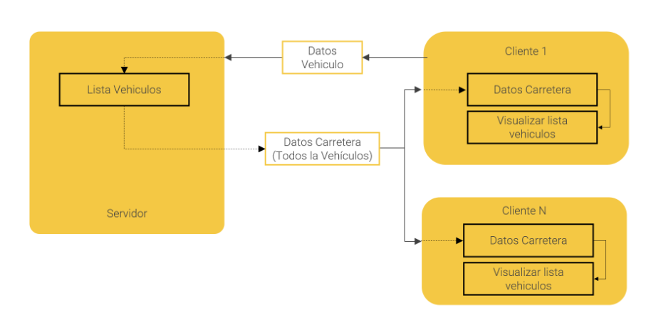
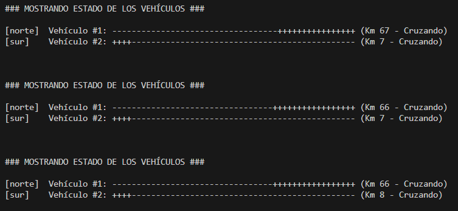
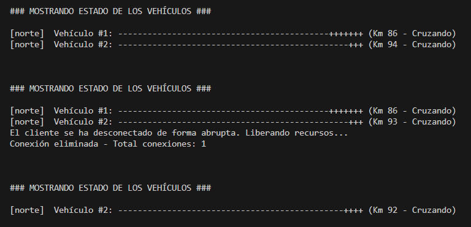
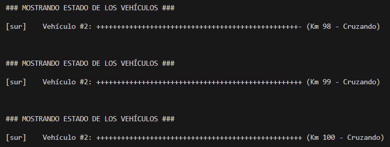

# 🧪 Ejercicio 2 - Intercambio de información entre vehículos en C&#35;

## 📌 Descripción del ejercicio

Este proyecto extiende la arquitectura cliente-servidor desarrollada previamente en C#, permitiendo el envío y recepción de **objetos serializados** entre cliente y servidor a través de `TcpClient`, `TcpListener` y `NetworkStream`.

Los principales objetivos del ejercicio son:

- Profundizar en el uso de `NetworkStream` para transmitir datos más complejos.
- Implementar la **serialización manual** de objetos como `Carretera` y `Vehiculo`.
- Desarrollar métodos genéricos de lectura y escritura para facilitar la comunicación binaria.
- Manejar la concurrencia desde el lado del cliente para actualizar datos en tiempo real.
- Simular el movimiento de vehículos por una carretera de forma dinámica.

---

## ⚙️ Funcionamiento general

### 🛣️ Simulación de la carretera

- La carretera se modela como un **vector lineal** (del 0 al 100).
- El servidor gestiona el estado global de esta carretera y mantiene una lista actualizada de la posición de los vehículos.

### 🚗 Movimiento del vehículo

- El objeto `Vehiculo` contiene atributos como su `id`, `posición` actual y `dirección`.
- La dirección puede ser:
  - `"sur"` → El vehículo se mueve de la posición 0 hacia la 100.
  - `"norte"` → Se desplaza en sentido inverso, de la 100 hacia la 0.
- Cada vehículo se mueve automáticamente cada cierto intervalo de tiempo (p. ej. 500 ms).
- Cuando el vehículo llega al final de la carretera, **se detiene**, actualizando el atribudo `acabado`.

### 🖼️ Diagrama del proyecto


---

## 🧵 Concurrencia en el cliente

El cliente lanza **dos hilos concurrentes** para gestionar la simulación de forma asíncrona:

### 1️⃣ Hilo de movimiento del vehículo

- Es responsable de actualizar la posición del vehículo de forma periódica.
- Formado por un bucle `for` que itera 100 veces.
- Después de cada actualización:
  - El vehículo se **vuelve a serializar**.
  - Se envía el nuevo estado al servidor mediante `EscribirDatosVehiculoNS`.

> Este hilo simula el avance físico del vehículo a lo largo de la carretera.

### 2️⃣ Hilo de escucha de estado de la carretera

- Se mantiene constantemente escuchando el `NetworkStream`.
- Cada vez que el servidor envía un nuevo estado de la carretera:
  - Se reconstruye el objeto `Carretera` mediante `LeerDatosCarreteraNS`.
  - Se muestra por consola el estado completo, actualizado.

> Esto permite al cliente tener una vista en tiempo real de todos los vehículos en circulación.

### 🛑 Sincronización y gestión de desconexiones

- Si ocurre una desconexión inesperada, se captura mediante excepciones y todos los recursos se detienen ordenadamente.

---

## 🧠 Aspectos técnicos destacados

### 📦 `NetworkStreamClass`

Contiene varios métodos estáticos reutilizables para facilitar la comunicación:

#### 📤 Escritura en `NetworkStream`:

- `EscribirDatosCarreteraNS(NetworkStream, Carretera)`
```csharp
public static void  EscribirDatosCarreteraNS(NetworkStream NS, Carretera C)
{
	// Pasar los datos a bytes
	byte[] DatosCarretera = C.CarreteraABytes();
	// Escribimos en el NS
	NS.Write(DatosCarretera, 0, DatosCarretera.Length);
}
```
- `EscribirDatosVehiculoNS(NetworkStream, Vehiculo)`
```csharp
public static void  EscribirDatosVehiculoNS(NetworkStream NS, Vehiculo V)
{
	// Pasar vehiculo a bytes
	byte[] DatosVehiculo = V.VehiculoaBytes();
	// Escribir en el NS
	NS.Write(DatosVehiculo, 0, DatosVehiculo.Length);
}
```
- `EscribirMensajeNetworkStream(NetworkStream, string)`
> Detallado en el proyecto del Ejercicio 1.

#### 📥 Lectura desde `NetworkStream`:

- `LeerDatosCarreteraNS(NetworkStream) → Carretera`
```csharp
public static Carretera LeerDatosCarreteraNS (NetworkStream NS)
{
	int bytesLeidos = 0;
	var tmpStream = new MemoryStream();
	byte[] bytesTotales;
	byte[] buffer = new byte[1024];
	
	do
	{   // Leemos del NS y escribimos en un stream temporal
		int bytesTemporales;
		try 
		{
			bytesTemporales = NS.Read(buffer, 0, buffer.Length);
		} catch (Exception)
		{
			return null;
		}
		tmpStream.Write(buffer, 0, bytesTemporales);
		bytesLeidos = bytesLeidos + bytesTemporales;
	} while (NS.DataAvailable);
	
	bytesTotales = tmpStream.ToArray();
	// Pasamos bytes a Carretera
	return Carretera.BytesACarretera(bytesTotales);
}
```

- `LeerDatosVehiculoNS(NetworkStream) → Vehiculo`
```csharp
public static Vehiculo LeerDatosVehiculoNS (NetworkStream NS)
{
	int bytesLeidos = 0;
	var tmpStream = new MemoryStream();
	byte[] bytesTotales;
	byte[] buffer = new byte[1024];

	do
	{   // Leemos del NS y escribimos en un stream temporal
		int bytesTemporales;
		try 
		{
			bytesTemporales = NS.Read(buffer, 0, buffer.Length);
		} catch (Exception)
		{
			return null;
		}
		tmpStream.Write(buffer, 0, bytesTemporales);
		bytesLeidos = bytesLeidos + bytesTemporales;
	} while (NS.DataAvailable);
	
	bytesTotales = tmpStream.ToArray();
	
	// Pasamos bytes a Vehiculo
	return Vehiculo.BytesAVehiculo(bytesTotales);
}
```

- `LeerMensajeNetworkStream(NetworkStream) → string`
> Detallado en el proyecto del Ejercicio 1.

### 🛠️ Serialización manual

Tanto `Vehiculo` como `Carretera` implementan métodos específicos para:

- **Serializar a bytes:** `CarreteraABytes()` y `VehiculoaBytes()`
- **Deserializar desde bytes:** `BytesACarretera()` y `BytesAVehiculo()`

Esto permite el control total del formato de los datos enviados y evita dependencias externas.

---

# 🖼️ Capturas de pantalla

### ▶️ Movimiento en ambas direcciones


### 💬 Gestion de las desconexiones

> Consola servidor

> Consola cliente

### 🚗 Finalizacion del recorrido


---

# 🚀 Cómo ejecutar el proyecto

1. Abre la solución en *Visual Studio* o *Visual Studio Code*.
2. Ejecuta primero el proyecto **servidor**.
3. Ejecuta luego tantas instancias del proyecto **cliente** como desees.

---

# ✅ Conclusiones

- Se ha conseguido simular una red cliente-servidor que transmite y gestiona objetos personalizados de forma concurrente y eficiente.
- La arquitectura basada en hilos permite simular en tiempo real tanto la actualización como la visualización del sistema.
- El sistema es escalable, y puede extenderse fácilmente para incluir más vehículos.

