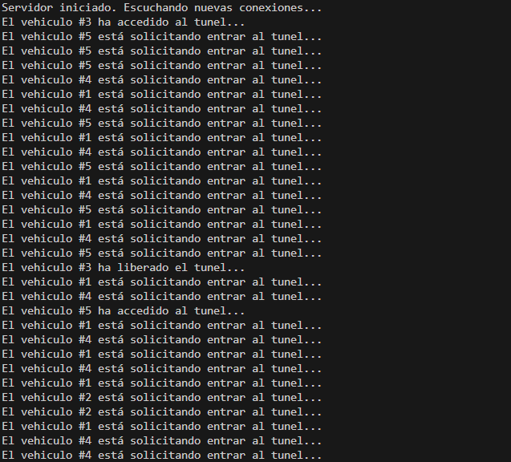
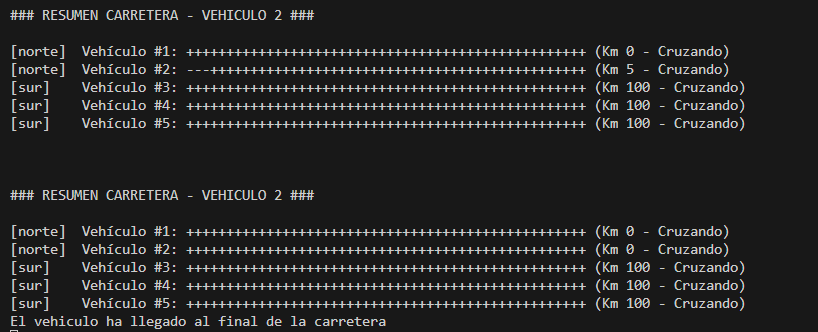

# 🧪 Ejercicio 3 - Control de tráfico en el túnel en C&#35;

## 📌 Descripción del proyecto

Este proyecto implementa un sistema cliente-servidor en C# para simular un túnel por el cual los vehículos deben solicitar acceso antes de cruzar. Los clientes representan vehículos que notifican su posición al servidor, el cual actúa como gestor del túnel, controlando el acceso mediante colas de espera y sincronización.

Los objetivos principales del proyecto son:

- **Gestionar concurrencia:** Implementar un control centralizado en el servidor para manejar múltiples vehículos accediendo simultáneamente.
- **Serializar y deserializar datos:** Transmitir objetos personalizados como `Vehiculo` y `Carretera` a través de `NetworkStream` utilizando serialización manual.
- **Sincronizar clientes y servidor:** Mantener un estado compartido y actualizado entre todos los componentes del sistema.

---

## ⚙️ Funcionamiento general

### 🛣️ Gestión de la carretera

- El servidor modela una carretera con múltiples vehículos (`Carretera`).
- Cada vehículo tiene atributos como `id`, `posición` y `dirección`, y solicita acceso al túnel cuando alcanza ciertas posiciones críticas.

### 🚗 Movimiento de vehículos

- Los clientes envían su posición al servidor cada **5 movimientos**, y el servidor procesa esta información para actualizar la carretera.
- Si un vehículo llega al túnel, espera la autorización del servidor para cruzarlo.
- El túnel solo permite que un vehículo esté dentro de él en cada momento, gestionando colas de espera para resolver conflictos.

---

## 🧵 Concurrencia y sincronización

### 💡 Lógica del servidor

1. **Cola de espera del túnel:**
   - Los vehículos que llegan al túnel se encolan en una estructura concurrente.
   - El servidor procesa la cola asegurándose de que solo un vehículo pueda cruzar el túnel a la vez.

2. **Sincronización:**
   - Se emplean `lock` y `SemaphoreSlim` para garantizar que las operaciones críticas (como actualizar el estado del túnel) sean seguras en entornos concurrentes.

### 🔄 Comunicación cliente-servidor

- **Actualizaciones periódicas:** Los clientes envían sus posiciones al servidor cada 5 movimientos, notificando el estado de cada vehículo.
- **Sincronización:** El servidor transmite el estado actualizado de la carretera a todos los clientes, asegurando una vista global compartida.

---

## 🧠 Respuestas a las preguntas teóricas

### **Pregunta 1: Ventajas e inconvenientes de programar el control del túnel en el cliente o el servidor**

| **En el cliente**                                                                                 | **En el servidor**                                                                                |
|----------------------------------------------------------------------------------------------------|----------------------------------------------------------------------------------------------------|
| **Ventajas:**                                                                                     | **Ventajas:**                                                                                     |
| - Descentraliza la carga de trabajo, haciendo que el servidor sea más ligero y eficiente.          | - Centraliza el control, asegurando consistencia y evitando conflictos entre vehículos.           |
| - Reduce la complejidad de sincronización en el servidor.                                          | - Facilita el manejo de condiciones de carrera al procesar los datos de forma unificada.          |
| - Los clientes toman decisiones localmente, reduciendo el número de mensajes enviados al servidor. | - La lógica es centralizada y fácil de mantener, ya que las reglas están concentradas en un único lugar. |
| **Inconvenientes:**                                                                                | **Inconvenientes:**                                                                                |
| - Puede llevar a conflictos si dos clientes toman decisiones contradictorias.                     | - Requiere más potencia de procesamiento y concurrencia por parte del servidor.                   |
| - Los vehículos no tienen una vista global del estado del túnel, lo que puede llevar a errores.    | - Incrementa la complejidad del servidor, ya que debe gestionar más datos simultáneamente.        |
| - Dificulta la escalabilidad, ya que los clientes deben asumir más responsabilidades.              | - Incrementa el tráfico de red debido a la constante comunicación entre los clientes y el servidor. |

---

### **Pregunta 2: Cómo gestionar colas de espera con prioridad según la dirección**

Para gestionar las colas de espera en el túnel y priorizar vehículos según su dirección, una buena opción sería utilizar una **PriorityQueue**. Esta estructura permite organizar a los vehículos de manera eficiente, garantizando que los vehículos con mayor prioridad (como aquellos que van en una dirección preferente) sean procesados primero.

---
# 🧠 Aspectos técnicos destacados
##📦 NetworkStreamClass
Contiene métodos reutilizables para enviar y recibir datos a través de NetworkStream, incluyendo:
- ####Serialización/Deserialización:
	- EscribirDatosCarreteraNS y LeerDatosCarreteraNS para manejar objetos de tipo Carretera.
	- EscribirDatosVehiculoNS y LeerDatosVehiculoNS para manejar objetos de tipo Vehiculo.

- #### Manejo de mensajes genéricos:
	- EscribirMensajeNetworkStream y LeerMensajeNetworkStream para enviar y recibir texto plano.

## 🛠️ Serialización manual
Se utiliza XML para serializar objetos como Vehiculo y Carretera. Esto permite un control preciso sobre el formato.

---

# 🖼️ Capturas de pantalla

### 💬 Gestión del puente (Consola Servidor)

### 🚗 Paso por puente y finalización de recorrido

> En esta imagen se observa que los vehiculos 1, 2 y 4 esperan a pasar al tunel, mientras que el 3 acaba de salir y el 5 apenas está entrando.

---

# ✅ Conclusiones
- Se ha logrado implementar un sistema eficiente y concurrente para gestionar el acceso de vehículos a un túnel.
- La arquitectura basada en colas de prioridad garantiza que las reglas de prioridad puedan modificarse fácilmente, manteniendo flexibilidad y escalabilidad.
- Este proyecto ilustra los beneficios de utilizar programación asíncrona y estructuras de datos avanzadas en escenarios de concurrencia.